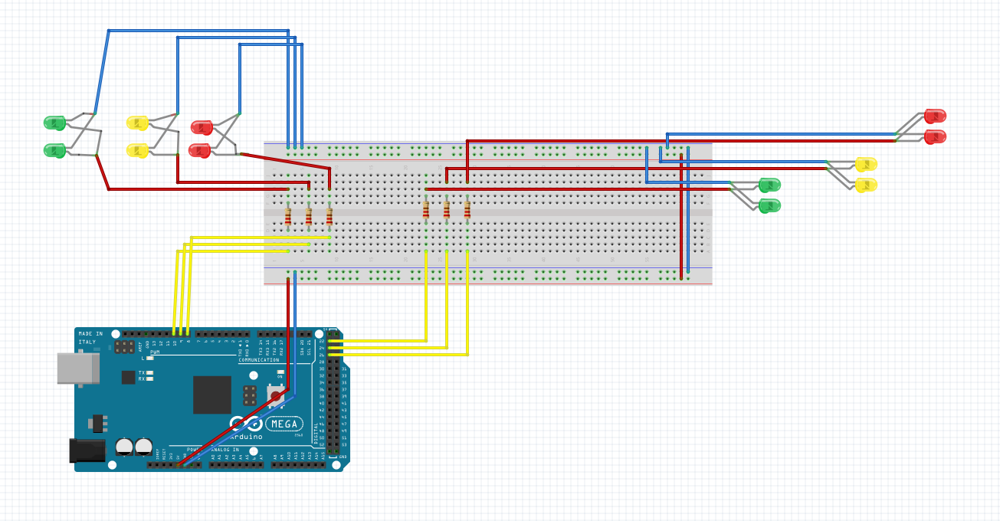

## Traffic Light Control :vertical_traffic_light:
My final project for the **Introduction to Robotics Course**.
## Description
This project is inspired from an intersection that I pass by everyday, and it's a awful one! This is a mini-replica of the 4 way intersection.
## Projects Requirments
| Component Name | Quantity |
| -------------  |:--------:|
| Arduino Mega   | 1        |
| LEDs           | 12       |
| Wires          | N/A      |
| 0.22k Resistors| 6        |
| Hobbyglass     | N/A      |
| Breadboard     | 1        |
## Projects Fritzing Schema

 
